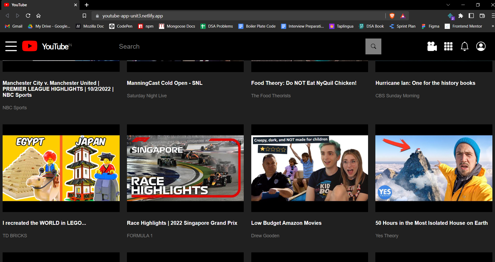
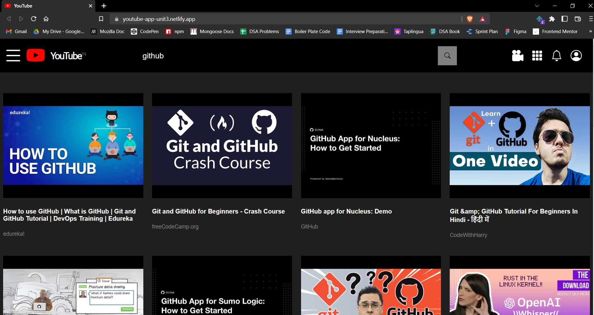
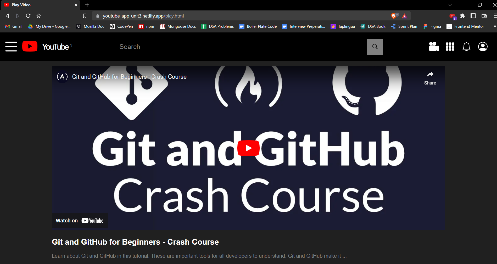

# Youtube App

Hello everyone, here is my Youtube App project which I builded in unit-3 with the help of `https://console.cloud.google.com/apis/library/youtube.googleapis.com` api. Link of deployment:- https://youtube-app-unit3.netlify.app/

## Features

- Search any youtube video and watch it.
- Get some random data first time.
- Responsive layout.

## Screenshots

### 1. Home Page

### 2. Search Results

### 3. Video Page

## Tech Stack

In this project we used following tech stacks:- 
- [HTML](https://developer.mozilla.org/en-US/docs/Web/HTML)
- [CSS](https://developer.mozilla.org/en-US/docs/Web/CSS)
- [JS](https://developer.mozilla.org/en-US/docs/Web/JavaScript)
- [Media Queries](https://developer.mozilla.org/en-US/docs/Web/CSS/Media_Queries/Using_media_queries)

## Connect with author

- [Twitter](https://twitter.com/harshal258)
- [LinkdIn](https://www.linkedin.com/in/harshalpardeshi/)

## Feedback

If you have any feedback or queries, please reach out to me at pardeshiharshal90@gmail.com.
